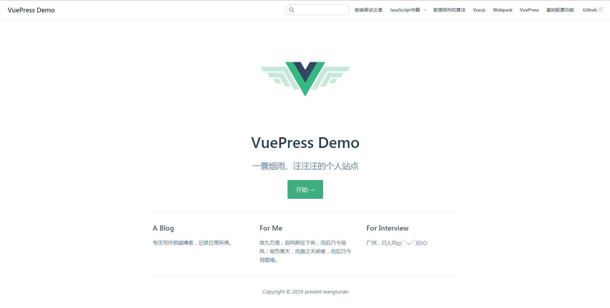
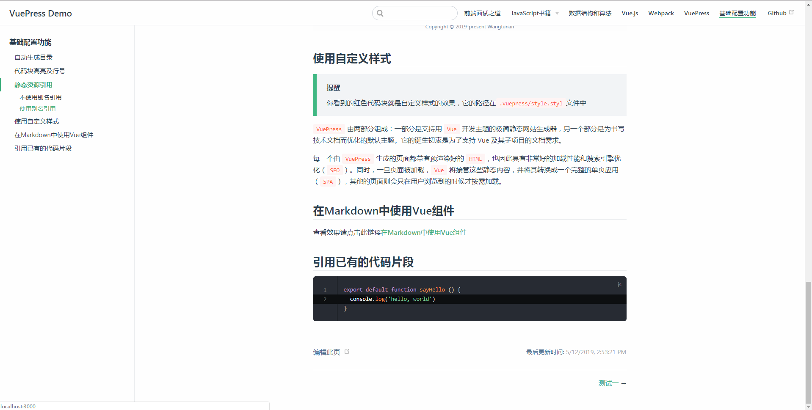

# 序

此仓库提供了一些常用的 VuePress配置案例

## 配置截图

### 首页

### 基础配置效果

## 目录
```js
|-- docs
|--  |-- .vuepress
|--  |--  |   |--components
|--  |--  |   |   |--customerComponent.vue
|--  |--  |   |--js
|--  |--  |   |   |--hello.js
|--  |--  |   |--public
|--  |--  |   |   |--icon.png
|--  |--  |   |   |--logo.jpg
|--  |--  |-- config.js
|--  |--  |-- style.styl
|--  |-- algorithm
|--  |--  |-- README.md
|--  |-- books
|--  |--  |-- 你不知道的javascript上.md
|--  |--  |-- 你不知道的javascript中.md
|--  |--  |-- 你不知道的javascript下.md
|--  |-- interview
|--  |--  |-- README.md
|--  |-- vue
|--  |--  |-- README.md
|--  |-- webpack
|--  |--  |-- README.md
|--  |-- common
|--  |--  |-- README.md
|--  |--  |-- next1.md
|--  |--  |-- next2.md
|--  |--  |-- component.md
|--  |-- images
|--  |--  |   |--vue
|--  |--  |   |   |--1.png
|--  |--  |   |--vuepress
|--  |--  |   |   |--1.png
|--  |--  |   |   |--2.png
|--  |--  |   |   |--3.png
|--  |-- README.md
|--  |-- package.json
|--  |-- README.md
```

## 功能列表
下面列表展示了此`Demo`详细的配置功能列表
* 首页(已支持)
* 导航栏(已支持)
* 自动生成侧边栏(已支持)
* `icon`配置(已支持)
* 代码块高亮和行号(已支持)
* 端口号(已支持)
* 仓库链接(已支持)
* 最后更新事件(已支持)
* 编辑此页(已支持)
* 静态资源别名(已支持)
* 上一篇/下一篇(已支持)
* 自定义样式(已支持)
* 在Markdown中使用Vue组件(已支持)
* 引用已有的代码片段(已支持)

## 安装、启动和打包
在使用前请先安装VuePress
```sh
$ npm install -g vuepress
```

使用`npm run docs:dev`启动项目，启动后在浏览器中使用`localhost:3000`进行访问
```sh
$ npm run docs:dev
```

使用`npm run docs:build`打包项目
```sh
$ npm run docs:build
```